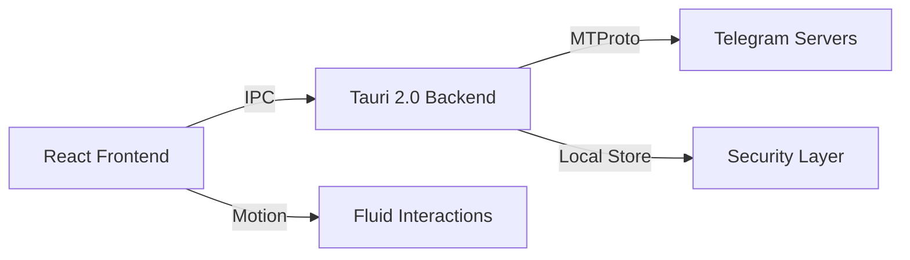

#  Telexio: The Future of Telegram Cloud

<div align="center">
  
</div>

<div align="center">
  <p align="center">
    <strong>Elevate your Telegram experience with premium cloud storage. Beautiful, Secure, and Blazing Fast.</strong>
  </p>
  <p align="center">
    <a href="#"></a>
    <a href="#"></a>
    <a href="#"></a>
    <a href="#"></a>
  </p>
</div>

---

## 🎨 Visual Identity & Design

Telexio isn't just a tool; it's a statement. Our branding reflects the clarity, speed, and reliability of the Telegram ecosystem.

<div align="center">
  <table border="0">
    <tr>
      <td align="center">
        
        <br /><b>Modern Variant 2</b>
      </td>
    </tr>
  </table>
</div>

---

## 🚀 Key Feature Highlights

<div align="center">
  
</div>

### 💎 The "Clean" Experience
- **📂 Dynamic File Explorer**: Choose between a high-fidelity **Grid View** or a detailed **List View**.
- **⚡ Instant Sync**: Real-time synchronization with your Telegram account.
- **🛡️ Secure by Design**: Your API keys and data stay on your machine. **No middle-man servers.**
- **🎨 Custom Folder Themes**: Assign colors to your folders for a truly personalized storage experience.

### 🎥 Media & Preview Engine
- **📺 Cinematic Video Player**: Stream high-definition videos directly from your Telegram cloud.
- **🎵 Pro Audio Player**: Listen to your music library with a sleek, minimalist player.
- **📄 Document Suite**: Built-in PDF reader and image lightbox for a seamless viewing experience.
- **🖼️ Smart Thumbnails**: High-resolution previews for all your media files.

---


## 🏗️ Technical Architecture



- **Backend**: Rust 1.75+ (High-concurrency file processing)
- **Frontend**: React 18 with Tailwind's OKLCH color system.
- **Security**: Local-only credential management using `tauri-plugin-store`.

---

## 🚦 Fast-Track Setup

### 1. Requirements
- A **Telegram account** 📱
- **API ID/Hash** from [my.telegram.org](https://my.telegram.org) 🔑
- **Rust & Node.js** (v18+) 💻

### 2. Quick Start
```bash
# Clone the vision
git clone https://github.com/caamer20/Telegram-Drive.git

# Enter the cockpit
cd Telegram-Drive/app

# Install the engine
npm install

# Ignite development
npm run tauri dev
```

---

## 🤝 Support the Vision

Telexio is **Free and Open Source Software** developed with ❤️ by **Caamer20**. 

> [!IMPORTANT]
> If you love using Telexio, please consider supporting the project to keep it ad-free and open-source forever.

<a href="https://www.paypal.me/Caamer20">
  
</a>

---

*Disclaimer: Telexio is an independent open-source project. Telegram and the Telegram Logo are trademarks of Telegram FZ-LLC.*
